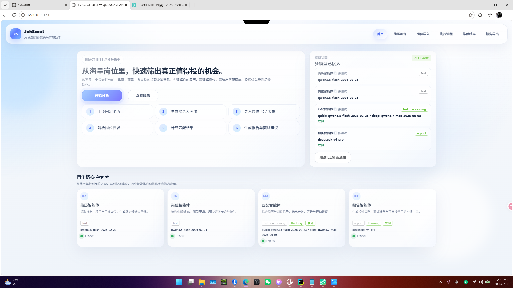
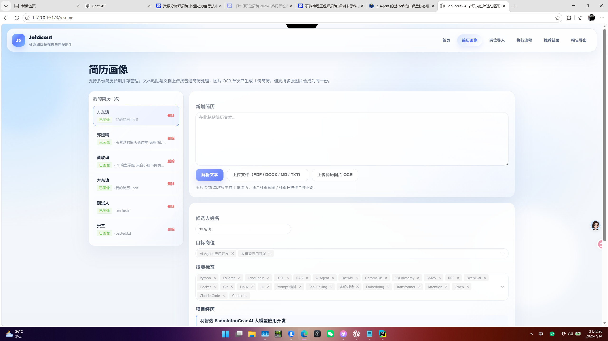
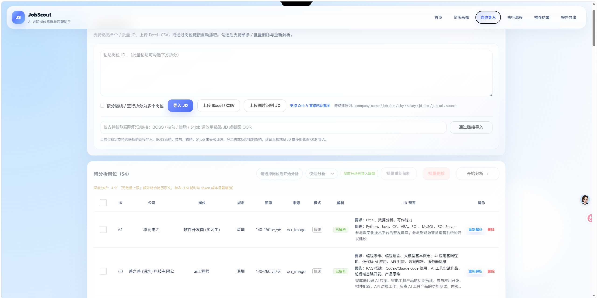
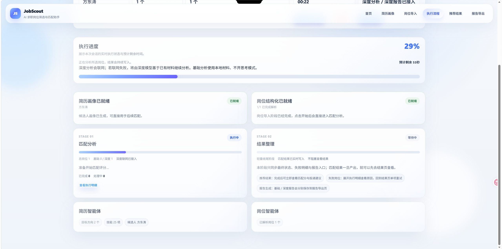
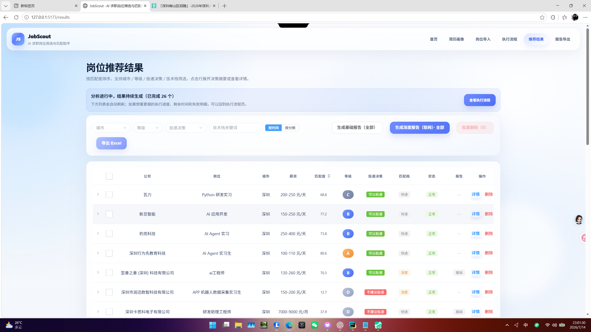
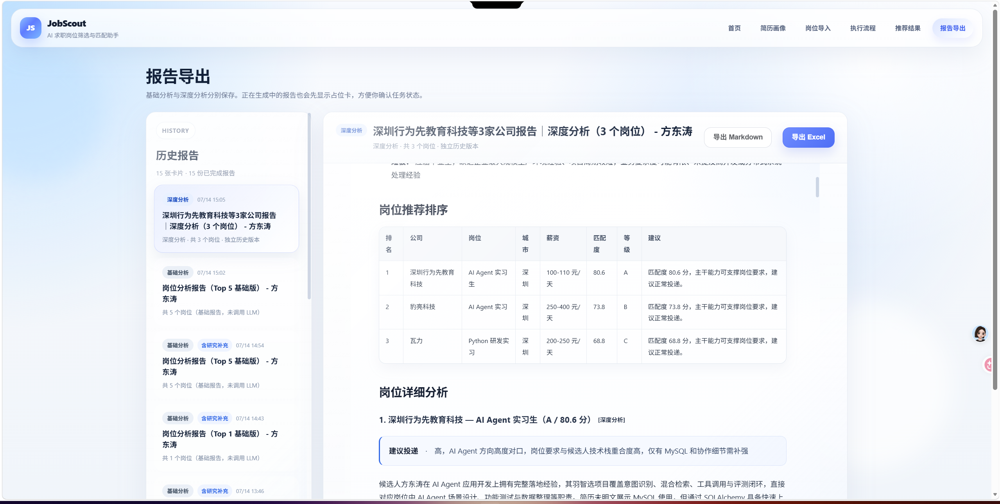

<div align="center">

# JobScout

### AI 求职岗位筛选与匹配多智能体助手

固定一份简历，批量理解岗位，快速找出真正值得投递的机会。

`Vue 3` · `FastAPI` · `LangGraph` · `SQLAlchemy` · `阿里云百炼` · `多级 OCR`

</div>

---

JobScout 面向需要处理大量招聘岗位的求职者。它不仅给出一个匹配分数，还会结合简历证据、岗位硬条件、职业方向和公开信息，回答四个更重要的问题：

- 这个岗位是否值得投？
- 匹配依据和关键缺口是什么？
- 哪些风险会影响简历筛选和面试？
- 投递前应该补充什么、面试时应该怎么表达？

> [!IMPORTANT]
> **待补截图 01：产品首页总览**
>
> 页面：`/`；文件：`docs/images/readme/01-home.png`。
> 建议使用 1440 × 900 浏览器窗口，完整拍到首页主卡片、模型状态和四个智能体卡片。

<!-- 截图到位后删除上方待补提示，并取消下一行注释：

-->

## 产品流程

```text
导入一份固定简历
        ↓
生成候选人结构化画像
        ↓
批量导入、OCR 或抓取岗位 JD
        ↓
选择基础分析或深度分析
        ↓
按后端并发逐岗位匹配
        ↓
筛选推荐结果、查看证据与风险
        ↓
按需生成基础报告或深度报告
```

简历智能体和岗位智能体在导入阶段完成结构化准备。开始分析后，工作流直接复用已有结果进行岗位匹配和结果整理，不会为了展示动画重复调用前置模型。

## 核心能力

| 能力 | 当前实现 |
| --- | --- |
| 简历画像 | 支持 PDF、DOCX、Markdown、TXT、粘贴文本和多张截图合并为一份简历 |
| 岗位导入 | 支持单条或批量 JD、Excel、CSV、智联招聘链接和最多 20 张岗位截图 |
| OCR 降级 | 腾讯 OCR → 失败项转百度 OCR → 仍失败项转阿里云百炼视觉模型 |
| 岗位结构化 | 提取公司、岗位、城市、薪资、学历、经验、技术栈、职责、硬条件和风险信号 |
| 基础分析 | 快速模型，不联网，不开启思考模式 |
| 深度分析 | 结合简历原文、结构化画像和清洗后的 JD，固定尝试联网 |
| 失败隔离 | 单个岗位、OCR 或联网调用失败不会阻断同批其他任务 |
| 报告体系 | 基础报告和深度报告独立保存；支持 Markdown 与 Excel 导出 |
| 执行可视化 | 展示阶段、逐岗位状态、错误原因、真实完成数和预计剩余时间 |

## 从原始材料到可验证结果

### 1. 简历画像

文本简历直接解析；图片简历允许一次上传多张图片并按顺序合成为一份简历。结构化画像保留技能、项目、目标岗位和求职条件，后续深度分析还会同时使用简历原文，避免结构化过程丢失细节。

> [!IMPORTANT]
> **待补截图 02：简历画像结果**
>
> 页面：`/resume`；文件：`docs/images/readme/02-resume-profile.png`。
> 请使用脱敏简历，拍到上传入口、候选人基本信息、技能和项目区，不要暴露手机号、邮箱和 API Key。

<!--  -->

### 2. 岗位导入与结构化

岗位可通过文本、表格、招聘链接或截图导入。OCR 原文会先清理招聘页面噪声，再由岗位智能体生成结构化内容；详情页同时保留结构化解析和 OCR 识别结果，便于核对信息是否遗漏。

> [!IMPORTANT]
> **待补截图 03：岗位导入与待分析列表**
>
> 页面：`/jobs`；文件：`docs/images/readme/03-job-import.png`。
> 拍到导入方式、截图数量上限、基础/深度模式、已解析岗位列表和明显的开始分析按钮。

<!--  -->

### 3. 基础分析与深度分析

| 模式 | 模型行为 | 联网行为 | 适合场景 |
| --- | --- | --- | --- |
| 基础分析 | 快速模型，不思考 | 不联网 | 大批量初筛、低成本排序 |
| 深度分析 | 推理模型，使用更多简历细节 | 固定尝试联网，失败自动降级 | 重点岗位、公司核验、投递决策 |

深度分析不是“先做一遍基础分析再做一遍深度分析”。用户勾选深度岗位后，该岗位直接进入深度链路，避免重复成本。联网失败时模型基于已有简历、岗位和匹配证据继续完成任务，并记录降级原因。

### 4. Agent 执行流

任务状态来自后端持久化数据，不由前端伪造。页面展示当前阶段、单岗位执行状态、成功/失败数量、进度和剩余时间；用户切换页面后可以根据后台任务恢复状态。

> [!IMPORTANT]
> **待补截图 04：正在运行的分析执行流**
>
> 页面：`/run`；文件：`docs/images/readme/04-execution-flow.png`。
> 请在任务执行中截图，至少包含一个处理中岗位、进度条、预计剩余时间、基础/深度数量和“深度联网已接入”状态。

<!--  -->

### 5. 推荐结果与岗位详情

推荐结果支持按城市、等级、投递决策、技术栈、时间和分数筛选。岗位详情会展示匹配证据、硬条件、技术栈覆盖、主要优势、关键缺口、联网状态和下一步建议。

> [!IMPORTANT]
> **待补截图 05：岗位推荐结果**
>
> 页面：`/results`；文件：`docs/images/readme/05-results.png`。
> 选择一组有明显分数差异的岗位，拍到筛选器、公司与岗位、分数、等级、投递建议和报告按钮。

<!--  -->

### 6. 报告生成与导出

基础报告和深度报告使用独立版本保存。正在生成的报告会显示占位卡片和后台进度；刷新或切换页面后仍可恢复。深度报告固定尝试联网，联网失败不会阻止报告模型继续生成。

> [!IMPORTANT]
> **待补截图 06：报告导出页面**
>
> 页面：`/reports`；文件：`docs/images/readme/06-reports.png`。
> 拍到左侧历史报告、基础/深度标签、报告正文和 Markdown/Excel 导出按钮；最好同时包含一个生成中的占位卡片。

<!--  -->

完整拍摄规范见 [README 截图清单](docs/images/readme/README.md)。

## 技术架构

| 层级 | 技术与职责 |
| --- | --- |
| 前端 | Vue 3、TypeScript、Vite、Pinia、Element Plus；负责交互和结构化状态展示 |
| API | FastAPI、Pydantic；负责协议映射、参数校验和错误响应 |
| 工作流 | LangGraph；编排简历、岗位、匹配和报告阶段 |
| 业务服务 | OCR、JD 清洗、模型路由、匹配、联网研究、报告生成和并发治理 |
| 数据 | SQLAlchemy、Alembic、SQLite；保存业务数据、任务状态和报告版本 |
| 模型 | OpenAI 兼容接口；各档位可独立配置厂商、Base URL、API Key 和模型 |

详细模块边界见 [系统架构说明](docs/architecture.md)。

## 本地启动

当前主线是本地直接启动，不依赖 Docker。

### 环境要求

- Python 3.13
- Node.js 22
- npm
- 至少一个已配置的 OpenAI 兼容模型端点

### 1. 创建根目录环境变量

```powershell
Copy-Item .env.example .env
```

编辑根目录 `.env`，填写实际使用档位对应的 API Key。`.env` 已被 Git 忽略，禁止提交真实密钥。

### 2. 启动后端

```powershell
cd server
python -m venv .venv
.\.venv\Scripts\python.exe -m pip install -r requirements.txt
.\.venv\Scripts\python.exe -m uvicorn main:app --reload --host 127.0.0.1 --port 8020
```

- API：`http://127.0.0.1:8020`
- Swagger：`http://127.0.0.1:8020/docs`
- 健康检查：`http://127.0.0.1:8020/health`

后端始终从项目根目录读取 `.env`。数据库初始化和 Alembic 增量升级在应用启动时执行。

### 3. 启动前端

新开一个 PowerShell：

```powershell
cd app
npm install
npm run dev
```

打开 `http://127.0.0.1:5173`。Vite 默认将 `/api` 和 `/health` 代理到 `http://127.0.0.1:8020`；需要更换后端地址时设置 `VITE_PROXY_TARGET`。

## 模型与 OCR 配置

完整字段、默认值和注释以根目录 [.env.example](.env.example) 为唯一示例真源。

### 模型档位

| 前缀 | 用途 |
| --- | --- |
| `LLM_FAST_*` | 简历解析、岗位解析和基础匹配 |
| `LLM_REASONING_*` | 深度匹配与联网研究 |
| `LLM_REPORT_*` | 深度报告 |
| `LLM_VISION_*` | 多模态 OCR 兜底 |
| `LLM_OCR_*` | OCR 专用模型档位 |
| `LLM_FALLBACK_*` | 主模型调用失败后的模型回退 |

每个档位都支持独立的 `PROVIDER`、`BASE_URL`、`API_KEY` 和 `MODEL`。未单独配置时回退到全局 `LLM_PROVIDER`、`LLM_BASE_URL`、`LLM_API_KEY` 和 `LLM_MODEL`。

### 并发与上限

| 变量 | 作用 |
| --- | --- |
| `JOB_AGENT_CONCURRENCY` | 岗位结构化并发数 |
| `MATCH_AGENT_CONCURRENCY` | 岗位匹配并发数 |
| `REPORT_AGENT_CONCURRENCY` | 报告生成并发数 |
| `FULL_MODE_LIMIT` | 单次深度岗位上限；`0` 表示不限制数量 |
| `DEEP_RESEARCH_MAX_ITEMS` | 单个深度任务最多生成的联网查询数 |
| `REPORT_HISTORY_LIMIT` | 历史报告保留数量 |

并发数由后端统一管理，前端不允许用户临时修改。

### OCR 凭证与限流

| 变量 | 作用 |
| --- | --- |
| `TENCENT_OCR_SECRET_ID` / `TENCENT_OCR_SECRET_KEY` | 腾讯 OCR 凭证 |
| `BAIDU_OCR_APP_ID` / `BAIDU_OCR_API_KEY` / `BAIDU_OCR_SECRET_KEY` | 百度 OCR 凭证 |
| `TENCENT_OCR_CONCURRENCY` / `TENCENT_OCR_RATE_PER_SEC` | 腾讯 OCR 并发和速率上限 |
| `BAIDU_OCR_CONCURRENCY` / `BAIDU_OCR_RATE_PER_SEC` | 百度 OCR 并发和速率上限 |
| `VISION_OCR_CONCURRENCY` | 百炼视觉兜底并发数 |

## 主要 API

| 资源 | 主要接口 |
| --- | --- |
| 简历 | `/api/resumes/upload`、`/parse`、`/import-images`、`/{id}/profile` |
| 岗位 | `/api/jobs/import-text`、`/import-file`、`/import-url`、`/import-images`、`/{id}/analyze` |
| 工作流 | `/api/agents/run`、`/tasks/{task_id}`、`/tasks/{task_id}/steps`、`/tasks/{task_id}/abort` |
| 匹配 | `/api/match/results`、`/results/{id}`、`/results/retry`、`/item-runs` |
| 报告 | `/api/reports/generate-batch`、`/tasks`、`/{id}`、`/{id}/markdown`、`/{id}/excel` |
| 系统 | `/health`、`/api/test-llm` |

请求和响应合同以 Swagger 为准。

## 测试与验收

后端：

```powershell
.\server\.venv\Scripts\python.exe -m pytest server -q -p no:cacheprovider
.\server\.venv\Scripts\python.exe -m compileall -q server
```

前端：

```powershell
cd app
npm run build
```

真实模型端到端验收会写入当前数据库，需要先启动后端并配置有效 Key：

```powershell
cd server
.\.venv\Scripts\python.exe e2e_test.py
```

## 项目结构

```text
.
├─ app/                         Vue 3 前端
├─ server/
│  ├─ routers/                  HTTP 接口适配层
│  ├─ schemas/                  请求、响应与结构化输出合同
│  ├─ services/                 OCR、解析、匹配、联网和报告核心逻辑
│  ├─ models/                   SQLAlchemy 数据模型
│  ├─ alembic/                  数据库迁移
│  ├─ sample_data/              端到端验收样例
│  └─ main.py                   FastAPI 入口
├─ docs/
│  ├─ architecture.md           架构说明
│  └─ images/readme/            README 截图与拍摄规范
├─ .env.example                 环境变量示例真源
└─ README.md
```

## 数据与安全

- `.env`、SQLite 数据库、构建产物、运行输出和依赖目录不会提交 Git。
- 不要在截图、日志、Issue 或报告中暴露 API Key、手机号、邮箱和身份证明。
- 本地数据库包含简历、岗位、匹配结果和报告，不能当作缓存随意删除。
- 招聘网站可能存在登录、验证码和反爬限制。智联招聘链接导入相对稳定；其他站点优先使用粘贴 JD 或截图 OCR。

---

<div align="center">

JobScout 的目标不是替用户做决定，而是让每一次投递都有证据、有优先级、有下一步行动。

</div>
